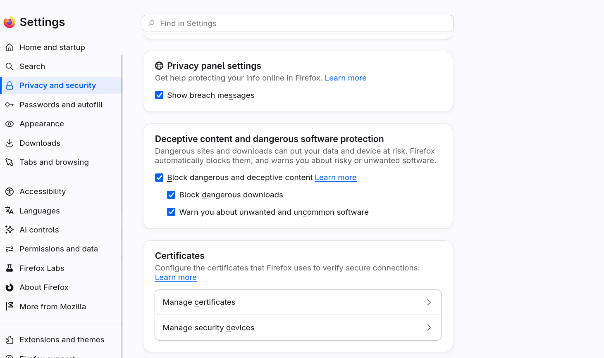
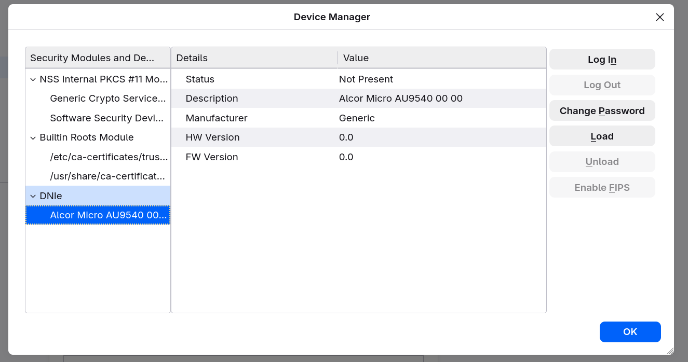

Recientemente he instalado Arch Linux en mi equipo principal y a día de hoy ha sido una decisión muy acertada. Software super actualizado y de momento (cruzo los dedos) tengo estabilidad total.  

[AutoFirma](https://sede.interior.gob.es/portal/sede/Firma-Electr%C3%B3nica/Preguntas-frecuentes/Autofirma.html) es la herramienta oficial de firma electrónica del Gobierno de España.  
  
Autofirma nos permite realizar trámites de firma gracias a nuestro certificado electrónico del DNIe.   

### Instalación drivers lector DNIe
  
Vamos a instalar los paquetes necesarios para nuestro lector de DNIe:
```bash
sudo pacman -S pcsclite pcsc-tools ccid opensc
```

- pcsclite → capa de abstracción para acceder al lector vía API PC/SC (trae el demonio pcscd)  
- ccid → driver genérico para lectores de tarjetas inteligentes (la mayoría de lectores USB lo usan)  
- pcsc-tools → utilidades, incluye pcsc_scan para comprobar que el lector y la tarjeta se detectan bien  
- opensc → ofrece herramientas y librerías para usar con lectores de tarjetas inteligentes, con soporte para DNIe, y es necesario para usarlo desde el navegador.  

Activamos el servicio pcscd:
```bash
sudo systemctl enable --now pcscd.service
```

Y ya podemos comprobar si detecta el lector:
```bash
pcsc_scan
```

Con el DNIe insertado veremos el ATR de la tarjeta.  


**Para usarlo en el navegador (Firefox):**  
El módulo PKCS#11 de OpenSC suele estar en /usr/lib/opensc-pkcs11.so o /usr/lib/pkcs11/opensc-pkcs11.so (comprueba con pacman -Ql opensc | grep pkcs11). Lo añades en Firefox → Ajustes → Privacidad y Seguridad → Dispositivos de seguridad → Cargar.





Con esta configuración mi sistema ya funciona sin necesidad de instalar el driver propietario de Policia.  

### Verificar correcto funcionamiento  

- Opción 1: Desde la propia gestión de dispositivos de Firefox  
Ve a Ajustes → Privacidad y Seguridad → Dispositivos de seguridad. Con el DNIe insertado en el lector, selecciona el módulo que cargaste (OpenSC) y pulsa "Iniciar sesión". Te debería pedir el PIN del DNIe. Si el PIN es correcto, el estado del dispositivo cambiará a "Sesión iniciada". Eso ya confirma que Firefox está hablando con la tarjeta.  

- Opción 2: Ver que aparecen los certificados  
Ajustes → Privacidad y Seguridad → busca "Certificados" → botón "Ver certificados". Si todo va bien, en la pestaña de "Tus certificados" deberían listarse los certificados del DNIe (autenticación y firma).

- Opción 3: Verificación desde la terminal
```bash
pkcs11-tool --module /usr/lib/opensc-pkcs11.so -L
# Esto debería listar el slot con tu lector y decir "token present" si el DNIe está insertado.
```

```bash
pkcs11-tool --module /usr/lib/opensc-pkcs11.so -O
# Para ver los certificados directamente
```

### Instalación de Autofirma

```bash
paru -Ss autofirma
aur/autofirma 1.9.2-1 [+51 ~1.14]
    Cliente de firma electrónica ofrecido por la Administración Pública
aur/autofirma-bin 1.9-3 [+22 ~0.02]
    Cliente de firma electrónica ofrecido por la Administración Pública
aur/autofirmaja 1.6.0.jav5-1 [+3 ~0.00]
    Cliente de firma electrónica de la Junta de Andalucia
aur/autofirma-git r7224.3d73a3073-1 [+1 ~0.00]
    Cliente de firma electrónica ofrecido por la Administración Pública
```

```bash
paru -S autofirma
```

Verificando el PKGBUILD podemos sacar las siguientes conclusiones:  

- El origen del código son fuentes oficiales: url='https://firmaelectronica.gob.es/'
source=("${pkgname}-${pkgver}.tar.gz::https://github.com/ctt-gob-es/${_pkgname}...  

- El desarrollo de AutoFirma es de código abierto. El mantenedor del paquete de AUR lo está descargando directamente desde el repositorio oficial de la Administración Pública en GitHub ([github.com/ctt-gob-es](https://github.com/ctt-gob-es), que corresponde al Centro de Transferencia de Tecnología).  

- Parches de corrección: # FIX: https://github.com/ctt-gob-es/clienteafirma/issues/320 (AGAIN)
_java_websocket_commit=8c5766a293c2dd3e0d035c0e0d70f88f57235fa8 (AutoFirma tiene un problema histórico en Linux con la gestión de conexiones locales (websockets) que a veces impide que las webs de la administración (como la de Hacienda o la Seguridad Social) se comuniquen correctamente con la aplicación instalada en tu ordenador).  

- Dependencias que va a instalar en el sistema: **jdk17-openjdk y java-runtime=17**: AutoFirma está programado en Java. Necesita obligatoriamente la versión 17 de Java para ejecutarse. **maven**: Es una herramienta de construcción para proyectos Java. Se instalará temporalmente solo para compilar el código de AutoFirma y construir el programa.


En mi caso voy a instalar autofirma, si queremos que el proceso sea más rápido podemos instalar autofirma-bin. Con "autofirma" se complila todo el código en nuestro sistema y tarda un poco más.  

Con esto ya está instalado y configurado correctamente nuestro DNIe.  

En [Autofirma en AUR](https://aur.archlinux.org/packages/autofirma) podemos ver los últimos comentarios del desarrollador muy interesantes para leer antes de la instalación.

***
Fuentes:  
[Autofirma en AUR](https://aur.archlinux.org/packages/autofirma)